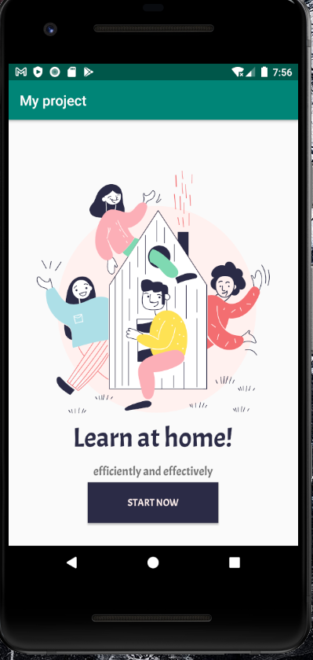
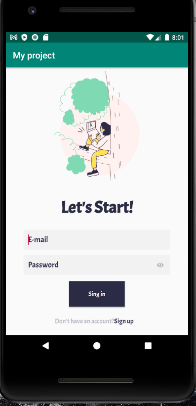

## Layout Exercise

- Hello , I made my first kotlin project
- In this Layout project, I did the exercise given about Styles and Fonts.
- Basically I made 3 screens of an application.
- First screen start page.
- The second screen is the screen containing the user login information.
- On the third screen, there is the user's switch to premium page.
- With this exercise, I actively used design and text screens in Layouts.

## Images LearnAtHome

## Images LestStart

## Images Lastpage

